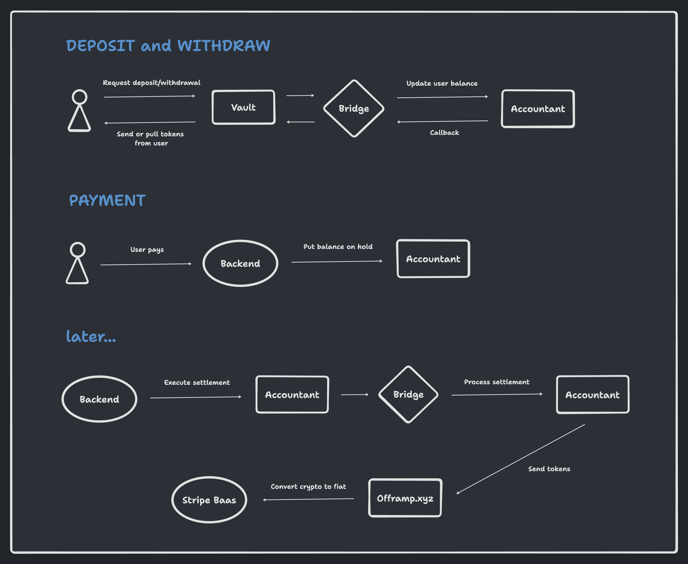

# Crypto cards done right
A public goods project aimed at creating the cheapest crypto debit card, with no hidden fees or costs, nor any centralised entity controlling it.

## Architecture

## Features
- Create multiple virtual and physical cards
- Top up your card with any crypto asset and from any EVM chain
- Pay anywhere in the world where Visa or Mastercard is accepted
- Control daily and monthly spend limits, pause and block cards
- Dispute fraudulent transactions
- Automatic capturing using ChainLink automation
- Settlement and accounting on a unique contract sitting on an Avax subnet

## Project structure
* **Backend** responsible for basic CRUD requests, displaying, updating and creating new resources (users, cards and disputes), built with NestJS and MongoDb on top of Stripe Issuing API
* **Frontend** the UI for the project, built with React and Vite
* **Smart contract** a collection of multi-chain vaults that call cross-chain using CCIP an accountant contract to keep track of deposits, withdrawals and payments, built with Solidity and Foundry and using CCIP (by ChainLink)
* **Avalanche Subnet** by leveraging Avax tech stack, the Accountant runs on its own subnet, allowing for fast and sub $0.001 cost transactions

## Backend
The backend is responsible for saving new users and logging in existing ones, creating new cards, updating their status and limits, and creating disputes for fraudulent transactions. It also validates card expenses by receiving webhooks from Stripe and checking if the card owner has got enough funds to cover the expense by calling the Accountant.

## Smart Contracts
The smart contract allow users to deposit and withdraw their card token balance across different blockchain networks. 

The system is built to ensure secure and efficient handling of assets, with the capability for the owner to hold and release funds as needed. It's akin to a digital banking system that operates across various blockchain platforms treating all balances as one, offering services like holding funds, acknowledging deposits and withdrawals, and executing complex financial operations. 

It could be particularly useful for users who operate on multiple blockchains and need a unified, secure way to top up their card from these networks.

### Technical Overview

**1. Accountant Contract:**
   - This contract acts as the central manager of user balances across different blockchain networks. It maintains records of user balances in a multi-chain environment and handles operations like acquiring and releasing holds on funds. The contract interacts with other contracts and systems via the Chainlink CCIP (Cross-Chain Interoperability Protocol), allowing it to send and receive messages across different blockchains. Functions include checking balances, capturing funds, and acknowledging deposits and withdrawals.
   Chainlink Automation bots automatically trigger the capture function when enough funds have been accrued to avoid useless gas expenses for micropayments.

**2. Vault Contract:**
   - The Vault contract is responsible for the direct management of users' funds. It supports deposit and withdrawal functions, enabling users to transfer their assets into and out of the system. It also incorporates a cool-off period to prevent rapid, repeated transactions that could frontrun a card payment. The contract can force withdraw funds, toggle token support status, and sweep unallocated funds to the owner. It uses the Chainlink CCIP to communicate with the Accountant contract for cross-chain operations, ensuring that deposits and withdrawals are correctly acknowledged and processed across blockchains.

## Frontend
A simple ReactJS + ChakraUI frontend allows for a seamless interaction with the system from the user perspective.

## Tech stack
- **Backend**: NestJS, MongoDb, Stripe Issuing API
- **Frontend**: React, Vite, ChakraUI
- **Smart contract**: Solidity, Foundry, ChainLink CCIP, ChainLink Automation
- **Avalanche Subnet**: Avalanche SDK and Bash
